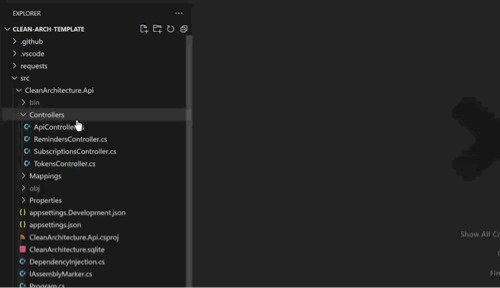
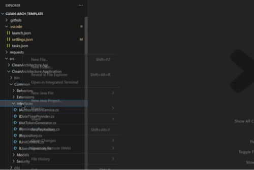
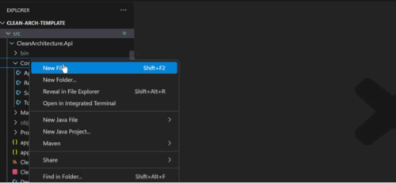

## Features

Auto write namespace when create new .cs file.



## Custom Template

The default template only write namespace, but you can add other things you want by configuration.

### Configuration Settings

This extension use Mustache to render result. the placeholder `{{namespace}}` and `{{filename}}` will be replaced by extension.

```jsonc
//.vscode/settings.json
{
  "namespaceStarter.templates": [
    {
      "name": "interface",
      "pattern": "**/I[A-Z]*.cs",
      "content": "namespace {{namespace}};\npublic interface {{filename}}\n{\n}" //
    },
    {
      "name": "controller",
      "pattern": "**/*Controller.cs",
      "content": "using Microsoft.AspNetCore.Mvc;\nnamespace {{namespace}};\n[ApiController]\n[Route(\"[controller]\")]\npublic class {{filename}} : ControllerBase\n{\n}"
    }
  ]
}
```


